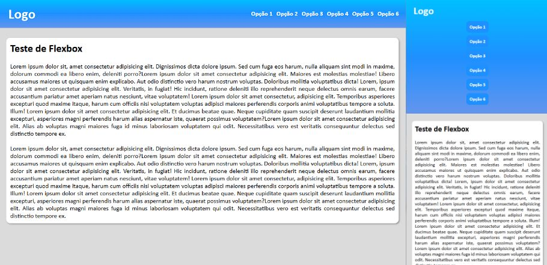

Menu de um site

# 🍔 Projeto Menu Responsivo

Uma interface moderna de menu responsivo desenvolvida com foco em experiência do usuário, organização visual e adaptação para diferentes dispositivos.

## 🚀 Sobre o projeto

O **Projeto Menu Responsivo** foi criado para praticar conceitos fundamentais e modernos do desenvolvimento front-end, utilizando uma estrutura limpa, visual agradável e interatividade dinâmica.

O projeto apresenta:

* Navegação responsiva
* Layout moderno
* Estrutura semântica
* Organização visual intuitiva
* Experiência adaptada para dispositivos móveis

## 🛠️ Tecnologias utilizadas

* HTML5
* CSS3
* JavaScript
* Git & GitHub

## 📱 Responsividade

O projeto foi desenvolvido pensando em diferentes tamanhos de tela:

* 💻 Desktop
* 📱 Smartphones
* 📲 Tablets

## ✨ Funcionalidades

* Menu responsivo
* Interações dinâmicas
* Estrutura moderna de navegação
* Layout adaptável
* Design limpo e organizado

## 🎯 Objetivos do projeto

* Evoluir habilidades em front-end
* Praticar responsividade
* Melhorar organização de layouts
* Trabalhar interatividade com JavaScript
* Desenvolver interfaces modernas

## 🌐 Deploy

Acesse o projeto online:

👉 https://renannavarro016.github.io/projeto-menu/

## 📸 Preview



## 📂 Como executar o projeto

```bash id="e0v6on"
# Clone o repositório
git clone https://github.com/seuusuario/projeto-menu.git

# Abra o index.html
```

## 👨‍💻 Desenvolvedor

Desenvolvido por Renan Navarro.

## 📌 Status

✅ Projeto finalizado
